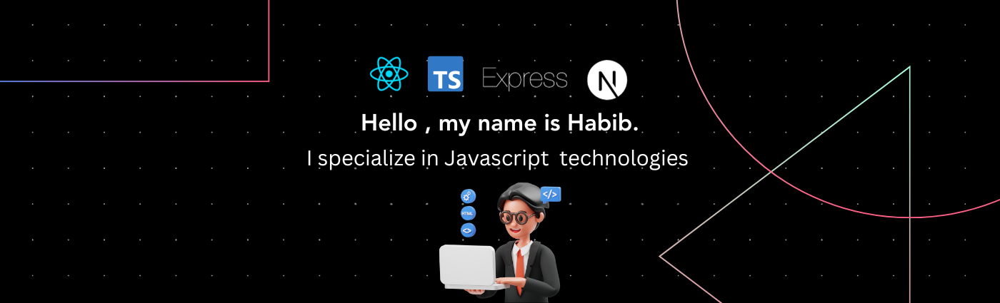

# Hi there! I'm Habib Razek 👋

🌍 **Based in Nabeul, Tunisia**

---
## 🛠️ Technical Skills

**Programming & Web Development**: HTML, CSS, JavaScript, TypeScript, ES6, React.js, Java, Git/GitHub, Docker  
**Frameworks**: Next.js, Express.js, Angular, Spring Boot, Tailwind CSS, Bootstrap  
**Databases**: MySQL, PL/SQL, Mongo DB  
**Software Design**: UML

    
    
    
    
    
    
    
    
    
    
    
    
    
    
    
    
    
    
    
    
    
    
    

## 🌐 Languages

**Arabic**: Native  
**German**: Intermediate (B1)  
**English & French**: Fluent

---

## 🚀 About Me

Passionate about technology and problem-solving, I'm a third-year student specializing in information systems development. With a strong adaptability and analytical mind, I excel in programming, system design, and data analysis. I'm keenly interested in contributing to innovative projects and furthering my expertise in this exciting field.

## 📫 How to reach me

**Email**: [habibrazeg23@gmail.com](mailto:habibrazeg23@gmail.com)  
**GitHub**: [HabibRazek](https://github.com/HabibRazek)

---

<!--
**HabibRazek/HabibRazek** is a ✨ _special_ ✨ repository because its `README.md` (this file) appears on your GitHub profile.

Here are some ideas to get you started:

- 🔭 I’m currently working on ...
- 🌱 I’m currently learning ...
- 👯 I’m looking to collaborate on ...
- 🤔 I’m looking for help with ...
- 💬 Ask me about ...
- 📫 How to reach me: ...
- 😄 Pronouns: ...
- ⚡ Fun fact: ...
-->
